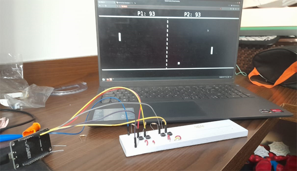

# esp8266pong
This was an attemp to play pong in another device controling only trough the esp8266, sadly I was unable to make it work in an acceptable manner.

## The problems
The main problem of all of this is the delay. Considering the way I implemented the way to read the inputs of a player trough checking if a button is pressed and then sending an event to the webpage makes an enormous ammount of events sent which not only makes the bars go extremely fast also makes the server quite laggy.

A minor way to somewhat lessen the problem of large quantity of events is to put a delay in the loop although that makes so the player will never be able to smoothly move up and down their bar, making the game relatively hard to play.

Also there are some random lag spikes for the inputs, which makes things even worse.

The other problem is that using the 10K resistors ass pull-up for the input switches still does not make the input absolutely precise, so it becomes necessary to use a delay in the loop.

## Conclusion

The esp8266 was not made for this kind of quick sucession updates to a web page so it makes sense it didn't work.

Here is a video of how it ended up looking:
https://youtu.be/v2pJ3QE5VCQ

## Image of the project

## Libraries used:

https://github.com/me-no-dev/ESPAsyncTCP

https://github.com/me-no-dev/ESPAsyncWebServer
